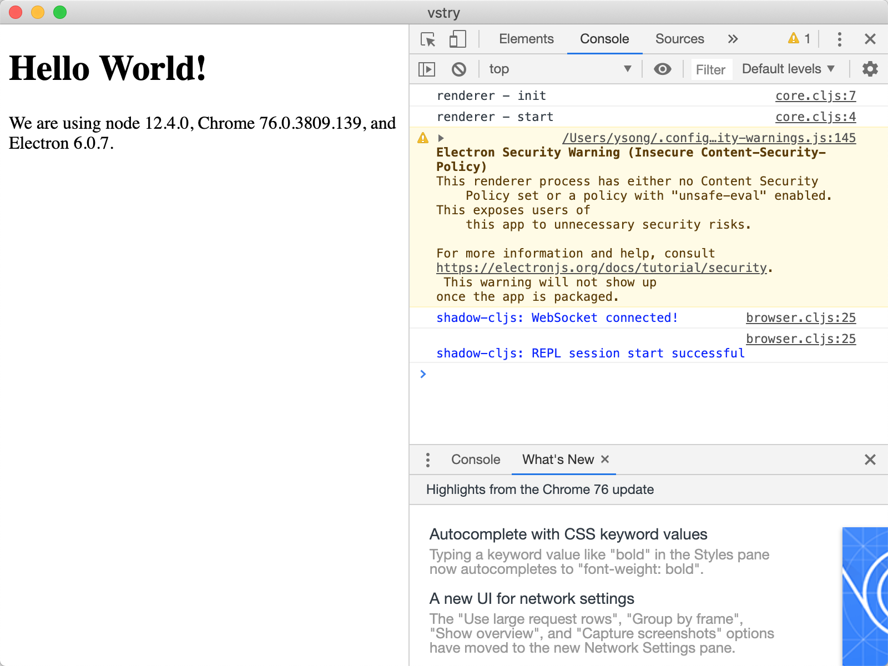

# vscode-remote-try-clojurescript
The demo project of clojurescript remote development with vscode.

## Libs / Tools 
- shadow-cljs
- electron 
- docker


## Development
```
git clone vscode-remote-try-clojurescript
cd vscode-remote-try-clojurescript
code vscode-remote-try-clojurescript
'Open Folder in Container'
```

then open bash terminal and run:

```
yarn 
npx shadow-cljs watch main ui
```

you can open a local electron to view the app

```
cd vscode-remote-try-clojurescript
electron .
```

